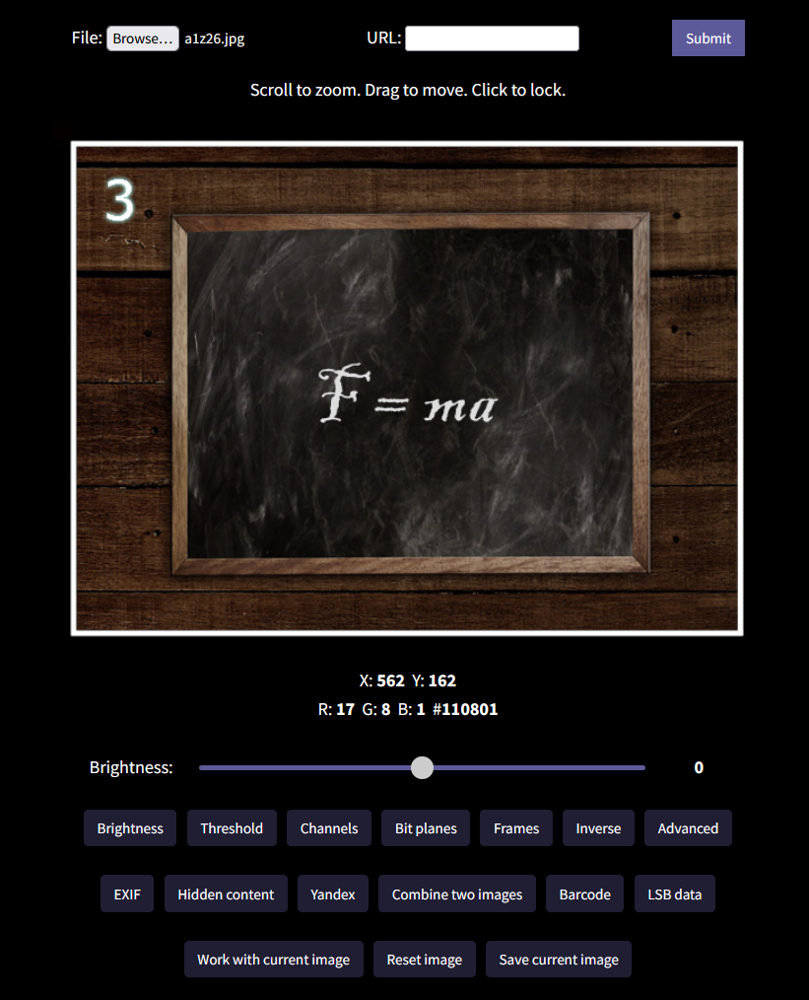

# RiddlImg - All you can do with online riddle images

Try now: [https://thestringharmony.com/riddlimg/](https://thestringharmony.com/riddlimg/)

Are you annoyed by using so many apps to check a single image?
Do you often forget some steps when checking images?

[**RiddlImg**](https://thestringharmony.com/riddlimg/) is a web application that collects many
common tricks for images used in online riddles. It is created by Kobe Li (infiniteXforever),
an experienced online riddle player and the creator of the online riddle
[The String Harmony](https://thestringharmony.com/).

Although RiddlImg is designed for online riddles, it is equally applicable in related contexts
such as CTF. Please share this tool to your community if you like it :)

## Features

* Import images from uploading or URL
* View the coordinates and RGB values of pixels
* Zoom in/out by scrolling and dragging
* Adjust brightness (gamma correction) and threshold values
* View color channels and bit planes
* View frames in GIF images
	- using the library [libgif-js](https://github.com/buzzfeed/libgif-js)
* Inverse color
* Advanced **scripting** on pixel values
* View EXIF data from `exiftool` (**with a selection of commonly used EXIF tags**)
	- using the library [PHPExiftool](https://github.com/romainneutron/PHPExiftool)
* View hidden content after the end of PNG/JPG
* Shortcut for reverse image search and OCR with [Yandex](https://yandex.com/images/)
* Combine two images with various blending modes
* Scan common barcodes
	- using the library [Html5-QRCode](https://github.com/mebjas/html5-qrcode)
	- see [here](https://github.com/mebjas/html5-qrcode#supported-code-formats) for supported barcode formats
* Extract data using LSB steganography
* Even more features are coming...

## Contact me

Ideas and suggestions are welcome. You can contact me (infiniteXforever) on
[Discord](https://discord.gg/q8pYdR73T8) by joining our online riddle server.